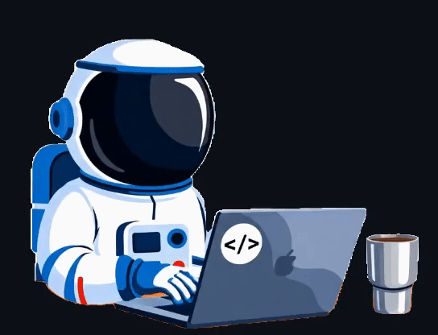

  

  
Contate-me:

  
  

  

 

  
  

    <samp>
      <b>🎯 Mais Informações</b>
    </samp>
  

 

# 

 

  <picture align="center">
    <source media="(prefers-color-scheme: dark)" srcset="https://raw.githubusercontent.com/Stanly1BR/Stanly1BR/output/github-contribution-grid-snake-dark.svg">
    <source media="(prefers-color-scheme: light)" srcset="https://raw.githubusercontent.com/Stanly1BR/Stanly1BR/output/github-contribution-grid-snake-dark.svg">
    
  </picture>

## 🚀 Habilidades e Tecnologias

### 💻 **Back-End:**
#### **Linguagens:**

#### **Frameworks:**

#### **Banco de Dados:**

### 🎨 **Front-End:**
#### **Tecnologias Principais:**

#### **Frameworks e Bibliotecas:**

### 🛠️ **Ferramentas:**
#### **Desenvolvimento:**

#### **IDEs:**

#### **Design e Gestão:**

 

## 📈 [Portfólio Stanly.dev](https://stanly1br.github.io/Portfolio/) - Meu portfólio pessoal responsivo

## 📫 **Contato:**

- **💼 LinkedIn**: [Stanly Almeida Do Carmo](https://www.linkedin.com/in/stanly-almeida-do-carmo/)
- **📍 Localização**: Aracaju, SE - Brasil

🚀 **"Code is like humor. When you have to explain it, it's bad."**

